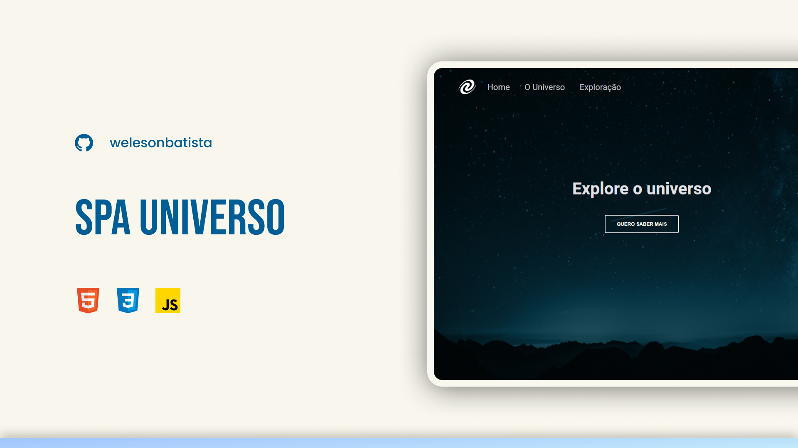

## 💻 Projeto

Para acesso o site [clique aqui](https://explore-universe.vercel.app/)

  

O que foi utilizado:

- Conceitos de SPA;
- Mapeamento de rotas;
- Assíncrono e promisses;
- Orientação a objetos;
- Classes e muito mais.

Também aprendi a criar um servidor local simples com NodeJs.

Feito por [Weleson Batista](https://github.com/welesonbatista) 🚀